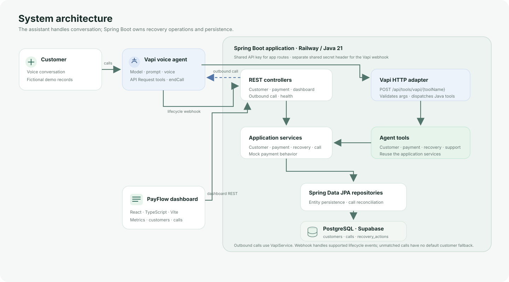
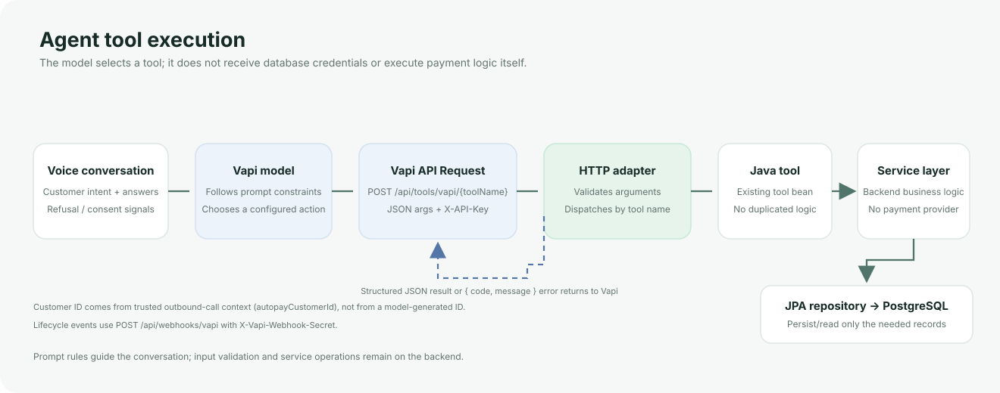
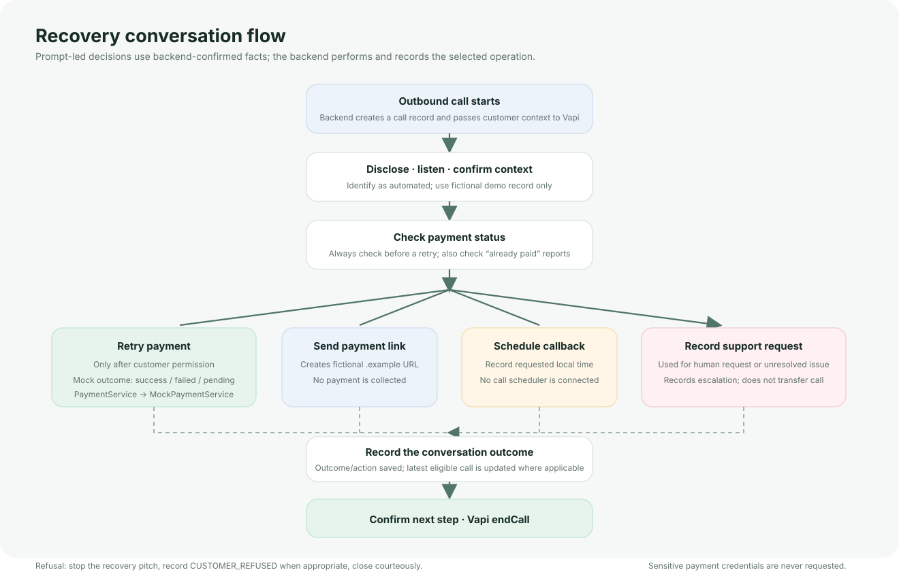
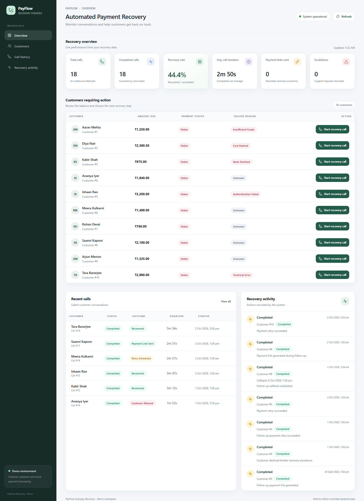
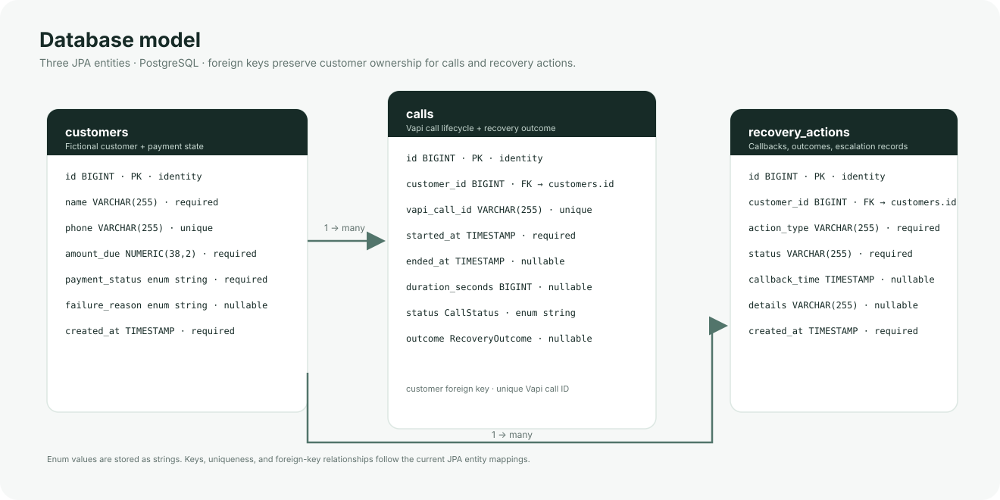
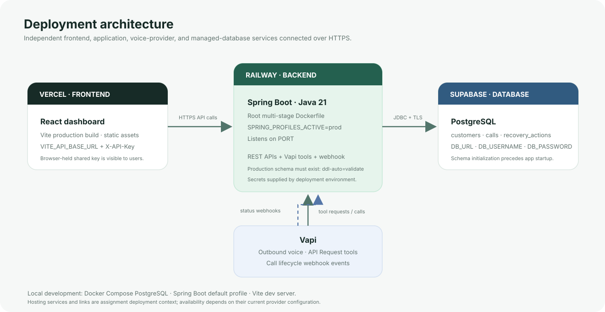

# Autopay Recovery Agent

**A voice-assisted recovery workflow with a small, auditable Spring Boot backend.** Vapi handles the conversation and invokes tools; the backend owns customer lookup, mock payment operations, recovery records, and call persistence.

[Open the live dashboard](https://autopay-recovery-agent.vercel.app/) · [Backend health endpoint](https://autopay-recovery-agent-production.up.railway.app/api/health) · [GitHub repository](https://github.com/adityasinha513/Autopay-recovery-agent)

> Assignment/demo system. Customer records are fictional and payment processing is mocked. No real payment is attempted or collected.



## Overview

Failed recurring payments need a clear next step: understand the reported failure, retry when appropriate, offer a way to pay, arrange a follow-up, or record a support request. This project demonstrates that workflow through a voice assistant, a REST API, and an operations dashboard.

The guiding design choice is **the AI handles conversation; the backend handles business operations**. The model selects from a finite set of HTTP tools. Spring validates each request and delegates to existing Java tools and services, keeping payment and persistence behavior out of the prompt.

## Architecture


The backend is a modular monolith:

- **Vapi** hosts the voice conversation, model, voice, API Request tools, and built-in `endCall` tool. A Vapi API Request invokes the backend over HTTPS.
- **Spring Boot** provides customer and payment APIs, the dashboard APIs, an outbound-call endpoint, an HTTP tool adapter, and a separate call-lifecycle webhook.
- **Agent tools and services** reuse `CustomerService`, `PaymentService`, `RecoveryService`, and `CallService`. `MockPaymentService` simulates payment attempts.
- **Spring Data JPA** persists `Customer`, `Call`, and `RecoveryAction` entities in PostgreSQL.
- **React dashboard** reads customers, calls, recovery activity, and metrics from the same API and can request an outbound call.

### Request boundaries



1. The backend loads the selected demo customer and creates a local call record when an outbound call is requested.
2. The server sends the customer phone/name to Vapi and sets the customer ID in call context (`autopayCustomerId`).
3. Vapi sends call lifecycle events to `/api/webhooks/vapi`. The backend maps supported status events onto the local call record and reconciles events that arrive before the create-call response.
4. During the conversation, a Vapi **API Request** sends direct JSON arguments to `/api/tools/vapi/{toolName}` with `X-API-Key`. The adapter validates the arguments and calls the existing Java tool.
5. The service result is returned to the model as JSON. Vapi can then speak the confirmed result and use its built-in `endCall` tool.

The assistant prompt asks it to check status before retrying and obtain customer permission. These are prompt-level conversation rules; the Java retry endpoint itself does not enforce the order or consent. Backend input validation and shared-key checks are enforced independently.

## Recovery workflow



The configured demo scenarios cover insufficient funds, expired card, bank decline, a customer who wants to pay now, an unrecognized payment, a request for human support, an “already paid” claim, a later callback, refusal, and a technical issue. These are prompt scenarios over the seeded data and tools; they are not separate scenario-specific backend rules.

## Agent tools

Vapi API Request tool names map directly to the existing Spring tool components:

| Tool | Required JSON arguments | Backend responsibility |
|---|---|---|
| `get_customer_details` | `customerId` | Return the selected fictional customer record. |
| `check_payment_status` | `customerId` | Read the current stored mock payment status and failure reason. |
| `retry_payment` | `customerId` | Run one mock attempt and persist its simulated status. |
| `send_payment_link` | `customerId` | Return a fictional `.example` checkout URL; it cannot collect payment. |
| `schedule_callback` | `customerId`, `callbackTime` | Store a callback action and requested local date/time. |
| `record_recovery_outcome` | `customerId`, `outcome` | Store an outcome and associate it with the latest eligible call when available. |
| `escalate_to_support` | `customerId`, `reason` | Record a support request; it does not transfer the call to a human. |

The full Vapi assistant example, system prompt, JSON schemas, expected response shapes, and Custom Credential setup are in [`docs/vapi-agent.md`](docs/vapi-agent.md).

## Backend API

All routes except health and the Vapi webhook require `X-API-Key`. The webhook uses `X-Vapi-Webhook-Secret` instead. Tool calls return normal JSON DTOs on success and `{ "code", "message" }` JSON errors for invalid tools/arguments and tool execution failures.

| Method | Endpoint | Purpose |
|---|---|---|
| `GET` | `/api/health` | Public health response: `{ "status": "UP" }`. |
| `GET` | `/api/customers` | List customer records. |
| `GET` | `/api/customers/{id}` | Get one customer by ID. |
| `GET` | `/api/customers/phone/{phone}` | Find a customer by phone. |
| `GET` | `/api/payments/{customerId}` | Read mock payment status. |
| `POST` | `/api/payments/{customerId}/retry` | Simulate a mock retry. |
| `POST` | `/api/payments/{customerId}/link` | Generate a fictional payment URL. |
| `POST` | `/api/calls/outbound/{customerId}` | Create a call record and request a Vapi outbound call. |
| `GET` | `/api/calls` | Recent call summaries for the dashboard. |
| `GET` | `/api/recovery-actions` | Recent recovery actions. |
| `GET` | `/api/metrics` | Metrics calculated from persisted call and action rows. |
| `POST` | `/api/tools/vapi/{toolName}` | Validate and dispatch one of the seven tool names above. |
| `POST` | `/api/webhooks/vapi` | Process supported Vapi call lifecycle messages. |

`/api/tools/vapi/{toolName}` accepts direct JSON arguments, not Vapi's Function Tool `tool-calls` envelope. Invalid arguments and unknown tool names return HTTP 400 JSON; missing customers return HTTP 404 JSON on the adapter; unexpected adapter errors return HTTP 500 JSON. The legacy customer/payment controllers use the API's existing error handling, so their 404 body is plain text.

## Dashboard

The dashboard is a React/TypeScript/Vite app hosted separately from the API. It displays system health, calls, completed calls, recovery rate, average duration, payment links, escalations, the fictional customer list, recent calls, and recovery activity. The metrics are computed by the backend from database rows; the page refreshes periodically and has a manual refresh action.



The screenshot is an actual capture of the deployed dashboard, not a mockup. Its call history and metric values are a point-in-time demo snapshot and will change as the shared demo database changes.

## Database design



The JPA entities map to three tables:

- **`customers`** has a unique phone, amount due, string-backed payment status and failure reason, and creation time.
- **`calls`** references a customer and stores a unique Vapi call ID, start/end times, duration, call status, and optional recovery outcome.
- **`recovery_actions`** references a customer and stores action type/status, optional callback time/details, and creation time.

All foreign keys point to `customers.id`. The application uses identity-generated `BIGINT` IDs. Enum values are persisted as strings. `CustomerDataInitializer` inserts the ten fictional customers only when the customer table is empty.

Local development uses Hibernate `ddl-auto=update`. The production `prod` profile uses `ddl-auto=validate`: it expects the schema to exist before the app starts and does not create or migrate production tables. There is no migration runner configured in Spring Boot.

## AI guardrails and security

The Vapi system prompt instructs the assistant to identify as automated, use tool-returned demo information, avoid sensitive credentials, check payment state before a retry, respect refusal/callback requests, avoid unsupported success claims, and record outcomes. The prompt is not a substitute for authorization or backend enforcement.

- **Payment behavior:** `MockPaymentService` randomly returns `SUCCESS`, `FAILED`, or `PENDING`; there is no payment provider. A generated link uses a reserved `.example` domain.
- **API access:** a shared `API_KEY` is checked using the `X-API-Key` header on protected `/api/**` routes. `/api/health` is public; `OPTIONS` preflight is allowed.
- **Webhook access:** `/api/webhooks/vapi` checks a separate `VAPI_WEBHOOK_SECRET` in `X-Vapi-Webhook-Secret`. This is a shared header value, not Vapi request-signature/HMAC verification.
- **CORS:** browser origins are controlled by `CORS_ALLOWED_ORIGINS`; CORS is not authentication.
- **Browser key limitation:** `VITE_API_KEY` is included in the frontend bundle and is observable by dashboard users. It is suitable only as a demo gate, not a secret or per-user authorization system.
- **Customer identity:** the outbound backend supplies the customer ID to Vapi call context; the tool adapter still accepts a `customerId` argument and checks that it exists. Conversational identity confirmation is prompt guidance, not a verified identity system.
- **Data:** use only the fictional seeded records. Do not enable real outbound calls or put secrets in source, docs, frontend variables other than the demo API key, or screenshots.

## Deployment



- **Vercel** serves the Vite frontend. Set `VITE_API_BASE_URL` to the Railway backend origin and `VITE_API_KEY` to the same shared key expected by the backend.
- **Railway** builds the repository-root [Dockerfile](Dockerfile), which uses a Maven/Temurin 21 build stage and a Java 21 JRE runtime stage. It sets `SPRING_PROFILES_ACTIVE=prod` and the app listens on Railway's `PORT`.
- **Supabase** hosts PostgreSQL. Provide a JDBC URL and credentials to the backend. Initialize the tables before the first `prod` startup because Hibernate validates rather than creates them.
- **Vapi** calls the public HTTPS tool routes with a Custom Credential carrying `X-API-Key`; configure the call lifecycle server URL as `https://autopay-recovery-agent-production.up.railway.app/api/webhooks/vapi` with the separate webhook header credential.

The deployed service links are provided for assignment review. Provider configuration and availability can change independently of this repository.

## Local development

Prerequisites: Java 21, Docker Compose, and Node.js/npm.

1. From the repository root, create the local environment files and replace the placeholder shared-key values with local random strings:

   ```powershell
   Copy-Item .env.example .env
   Copy-Item frontend/.env.example frontend/.env
   ```

2. Start PostgreSQL and the backend from the repository root:

   ```powershell
   docker compose up -d postgres
   .\mvnw.cmd spring-boot:run
   ```

   The local database defaults to `localhost:5434/autopay_recovery`. The default Spring profile uses `ddl-auto=update` for local schema setup.

3. Set `VITE_API_BASE_URL=http://localhost:8080` and `VITE_API_KEY` to the same value as `API_KEY` in `frontend/.env`, then start the dashboard:

   ```powershell
   cd frontend
   npm ci
   npm run dev
   ```

The local dashboard is normally at `http://localhost:5173`; the backend defaults to `http://localhost:8080`. Outbound calling also requires the Vapi variables listed below. Without them, the API remains usable but outbound call creation cannot complete.

## Environment variables

Do not commit `.env` files or real credentials. Backend variables are read from the process environment and the optional root `.env` file. Vite variables are build-time frontend configuration.

| Variable | Used by | Purpose / local default |
|---|---|---|
| `DB_URL` | Backend | Optional full JDBC URL; otherwise assembled from `DB_PORT`, `DB_NAME`. Production requires it. |
| `DB_NAME` | Compose/backend | Local database name; default `autopay_recovery`. |
| `DB_PORT` | Compose/backend | Local host port; default `5434`. |
| `DB_USERNAME` | Compose/backend | Local default `postgres`; supply deployment credential in production. |
| `DB_PASSWORD` | Compose/backend | Local development default `postgres`; replace for local use and supply a secret in production. |
| `PORT` | Backend | HTTP port; default `8080`, supplied by Railway in deployment. |
| `SPRING_PROFILES_ACTIVE` | Backend | Use `prod` on Railway; the Dockerfile sets this profile. |
| `API_KEY` | Backend | Shared application API key; no real value is stored in the repo. |
| `VAPI_WEBHOOK_SECRET` | Backend/Vapi | Separate shared value for the Vapi lifecycle webhook header. |
| `CORS_ALLOWED_ORIGINS` | Backend | Comma-separated browser origins; local Vite origins are the default. |
| `VAPI_API_KEY` | Backend | Server-side Vapi API credential for outbound call creation. |
| `VAPI_BASE_URL` | Backend | Vapi API base URL; defaults to `https://api.vapi.ai`. |
| `VAPI_ASSISTANT_ID` | Backend | Vapi assistant to use for outbound calls. |
| `VAPI_PHONE_NUMBER_ID` | Backend | Vapi phone-number resource used for outbound calls. |
| `VITE_API_BASE_URL` | Frontend | Backend origin; local dev defaults to `http://localhost:8080`. Set to Railway origin for Vercel. |
| `VITE_API_KEY` | Frontend | Shared key sent in browser API requests. It is public in the built assets; use only for the demo. |

For production, set `DB_URL`, `DB_USERNAME`, `DB_PASSWORD`, `API_KEY`, `VAPI_WEBHOOK_SECRET`, `PORT`, `CORS_ALLOWED_ORIGINS`, `SPRING_PROFILES_ACTIVE=prod`, and frontend build values `VITE_API_BASE_URL`, `VITE_API_KEY`. Outbound Vapi calls additionally require `VAPI_API_KEY`, `VAPI_ASSISTANT_ID`, and `VAPI_PHONE_NUMBER_ID`.

## Testing

Backend verification and tests:

```powershell
.\mvnw.cmd clean verify
```

Frontend dependency installation and production build:

```powershell
cd frontend
npm ci
npm run build
```

The current backend suite has **29 test cases** across application startup, API and webhook authentication, health response, dashboard metrics, Vapi tool dispatch/input errors, Vapi webhook reconciliation, and call/recovery services. No automated test makes a live Vapi call. The frontend build runs TypeScript project checks before Vite production bundling; there is no frontend unit-test script in `package.json`.

## Engineering decisions

- **Modular monolith:** one Spring Boot application keeps the assignment easy to run while separating controllers, tools, services, repositories, and provider integrations.
- **Backend-owned behavior:** the Vapi adapter calls existing Java tools, and tools delegate to services instead of embedding payment rules in HTTP or prompt code.
- **Explicit records:** calls and recovery actions are persisted separately from customers so dashboard history and webhook updates are inspectable.
- **Call reconciliation:** Vapi metadata carries the selected customer context; webhook matching does not guess a customer when metadata is absent, and terminal local call states are preserved against late status events.
- **Production schema validation:** `ddl-auto=validate` catches an uninitialized or mismatched production schema at startup instead of silently generating production DDL.

## Known limitations

- Payment attempts are random mock outcomes; payment links cannot be paid.
- Callback scheduling records a requested time but does not enqueue or place a future call.
- Escalation is recorded; there is no live human transfer or support queue.
- The system prompt expresses consent, disclosure, and refusal rules, but the backend does not independently enforce all conversational sequencing.
- The webhook handles the event types mapped in `VapiWebhookService`; it is not a general Vapi event processor and does not verify request signatures.
- The dashboard and demo API share one API key; there are no per-user roles, customer authorization boundaries, or rate limits.
- Production table creation is an operator/database setup step; no Flyway/Liquibase migration runner is wired into application startup.
- Dashboard queries return unpaginated data and calculate metrics from loaded rows.

## Production improvements

Before using real customers or payment methods, replace the mock payment implementation with an audited provider integration; add user authentication and authorization, rate limiting, secret rotation, signed webhook verification and idempotency; implement consent, opt-out, and customer verification as backend controls; add versioned migrations, audit logs, monitoring, alerting, retention rules, pagination, and provider contract tests. Move dashboard API access behind a server-side proxy or user session so no shared API key is shipped to browsers.

## Project structure

```text
.
├── src/main/java/com/razorpay/autopay/
│   ├── config/             # API key, CORS, demo customer initialization
│   ├── controller/         # REST APIs, Vapi adapter/webhook, dashboard
│   ├── dto/                # HTTP request/response shapes
│   ├── entity/             # Customer, Call, RecoveryAction
│   ├── integration/        # Mock payment and Vapi provider boundaries
│   ├── repository/         # Spring Data JPA persistence
│   ├── service/            # Customer, payment, recovery, call behavior
│   └── tool/               # Customer, payment, recovery, support tools
├── src/test/java/          # Backend test suite
├── frontend/src/           # React dashboard
├── docs/
│   ├── images/             # Architecture, flow, ERD, deployment, screenshot
│   └── vapi-agent.md       # Assistant prompt, API Request schemas, scenarios
├── Dockerfile              # Java 21 multi-stage backend image
├── docker-compose.yml      # Local PostgreSQL
└── pom.xml                 # Maven backend build
```

## Demo links

- [Live PayFlow dashboard](https://autopay-recovery-agent.vercel.app/)
- [Backend health endpoint](https://autopay-recovery-agent-production.up.railway.app/api/health)
- [Vapi assistant and tool contract](docs/vapi-agent.md)

The AI is responsible for a concise, respectful conversation. The backend is responsible for the data, validation, and recovery operations behind that conversation.
